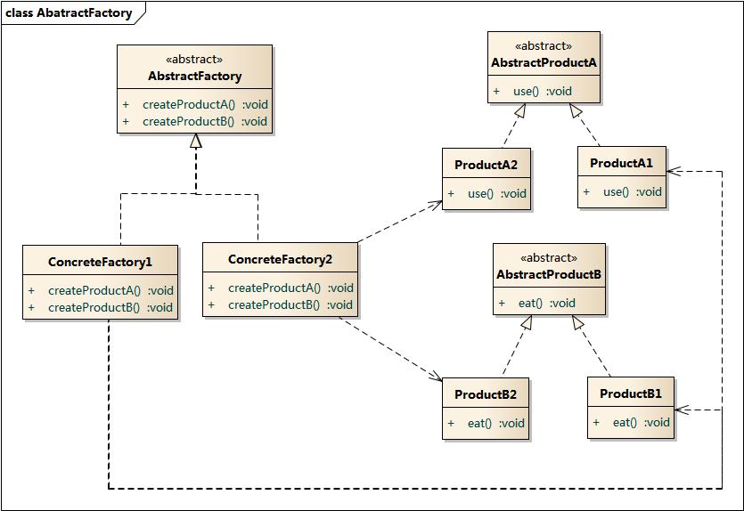

### 抽象工厂模式 - Abstract Factory Pattern  
学习难度：★★★★☆  
使用频率：★★★★★

写在前面:  
`对象创建型模型`  
产品等级结构 - 产品的继承结构  
`抽象类是电视机, 其子类有海尔电视机, 海信电视机等.`  
产品族 - 由同一工厂生产的, 位于不同产品等级结构中的一组产品  
`如海尔工厂生产的海尔电视, 海尔冰箱, 称为产品族.`

1. 定义(GoF)    
提供一个创建一系列相关或相互依赖对象的接口, 而无需指定它们具体的类.  
2. 别名  
Kit 
3. 动机  
4. 适用性  
(1)一个系统要独立于他的产品的创建, 组合和表示时;  
(2)一个系统要由多个产品系类中的一个来配置时;  
(3)当你要强调一系列相关的产品对象的设计以便进行联合使用时;  
(4)当你提供一个产品类库, 而只想显示它们的接口而不是实现时;

