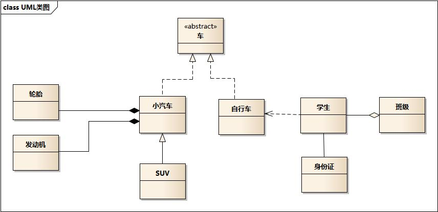

# 类之间的关系

# principle of Object Oriented Design 3-2-1-1

1. 单一职责原则 (Single Responsibility Principle, SRP)
一个类只负责一个功能领域内的相应职责
⭐️⭐️⭐️⭐️
2. 开闭原则 (Open-Closed Principle, OCP)
软件实体应对扩展开放, 而对修改关闭  
⭐️⭐️⭐️⭐️⭐️ 
3. 里氏代换原则 (Liskov Substitution Principle, LSP)
所有引用基类对象的地方能够透明的使用其子类对象
⭐️⭐️⭐️⭐️⭐️ 
4. 依赖倒转原则 (Dependence Inversion Principle, DIP)
抽象不应该依赖于细节, 细节应该依赖于抽象  
⭐️⭐️⭐️⭐️⭐️ 
5. 接口隔离原则 (Interface Segregation Principle, ISP)  
使用多个专门的接口, 而不使用单一的总接口  
⭐️⭐️  
6. 合成复用原则 (Composition Reuse Principle, CRP)  
尽量使用对象组合, 而不是继承来达到复用的目的  
⭐️⭐️⭐️⭐️  
7. 迪米特法则 (Law of Demeter)  
一个软件实体应当尽可能少的同其它实体发生相互作用  
⭐️⭐️⭐️  

