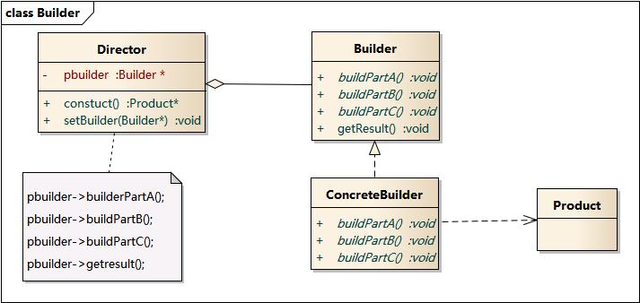

### 建造者模式 - Builder Pattern  
对象创建型模式  
学习难度：★★★★☆  
使用频率：★★☆☆☆

1. 定义  
将一个复杂对象的构建与它的表示分离, 使得同样的构建过程可以创建不同的表示.  

2. 适用性  
(1)当创建复杂对象的算法应该独立于该对象的组成部分以及它们的装配方式时;  
(2)当构造过程必须允许被构造的对象有不同的表示时;  

3. 结构  
Builder:  
`为创建一个 Product 对象的各个部件指定抽象接口.` 
`返回复杂对象的接口`   
ConcreteBuilder:  
`1. 实现 Builder 的接口以制造和装配该产品的各个部件`  
`2. 定义并明确它所创建的表示`  
`3. 提供一个检索产品的接口`  
Director:  
`构造一个使用 Builder 接口的对象`  
Product:  
`1. 表示被构造的复杂对象`  
`2. 包含定义组成部件的类, 包括将这些部件装配成最终产品的接口`  

### 关于 Director 的进一步讨论  

Director 类的角色非常重要, 指导具体建造者如何构建产品.  
它按照一定的次序调用 Builder 的 builderPartX()方法,  
控制调用的先后顺序, 并向客户端返回一个完整的产品对象.  

#### 讨论几种 Director 的高级应用方式  

1. 省略 Director  
为简化系统结构, 可以将 Director 与抽象建造者 Builder合并, 
在 Builder 中提供逐步构建复杂产品对象的 construct()方法.  
由于 Builder 类通常为抽象类, 因此可以将 construct()方法定义为静态方法.

2. 引入钩子方法  
建造者模式除了逐步构建一个复杂产品对象外,   
还可以通过 Director 类来更加精细的控制产品的创建过程,   
例如增加一类称之为钩子方法(HookMethod)的特殊方法来控制是否对某个 buildPartX()方法的调用.  

钩子方法通常返回 boolean 类型, 方法名一般为 isXXX(), 钩子方法定义在抽象建造者类中. 
在具体的构建者中覆盖此方法, 作为判断是否执行某个 buildPartX()方法的依据.  
`通过引入钩子方法，我们可以在Director中对复杂产品的构建进行精细的控制，  
不仅指定buildPartX()方法的执行顺序，还可以控制是否需要执行某个buildPartX()方法。`  

缺点:  
1. 构建者模式所创建的产品一般具有较多的共同点, 其组成部分相似, 因此  
其使用范围收到一定的限制.  
2. 如果产品的内部变化复杂, 可能会导致需要定义很多具体的建造者来实现这种变化.  

适用性:  
1. 产品结构复杂, 通常包含多个成员属性;  
2. 产品的属性相互依赖, 需要指定其生成顺序;  
3. 对象的创建过程独立于创建该对象的类, 
在建造者模式中引入了 Director 角色, 将创建过程封装在指挥者中, 而不在构建者或客户端;
4. 隔离复杂对象的创建和使用, 并使得相同的创建过程可以创建不同的产品.  