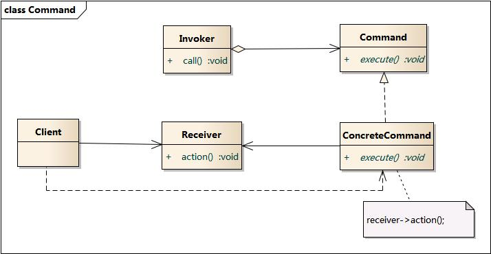

### Command Pattern - 命令模式 

对象行为型模式

1. 意图  
将一个请求封装为一个对象, 从而使你可用不同的请求对客户进行参数化;  
对请求排队或记录请求日志, 以及支持可撤销的操作.  

2. 别名  
动作 - Action, 事务 - Transaction  

3. 动机  
在软件设计中, 经常需要向某些对象发送请求, 但是并不知道请求的接受者是谁,  
也不知道被请求的操作是哪个, 只需在程序运行时指定具体的请求接受者即可,  
此时可使用命令模式, 使请求发送者与请求接收者消除彼此之间的耦合,  
让对象之间的调用关系更加灵活.  

4. 结构  
  

* Command: 抽象命令类  
声明执行操作的接口, 通过这些方法调用请求接受者的相关操作.  
* ConcreteCommand(aReceiver): 具体命令类  
将一个接收者对象绑定于一个动作;  
调用接收者相应的操作, 以实现 execute(), 并调用接受者对象的相关操作 action();  
* Invoker(aCommand): 调用者, 即请求的发送者  
要求该命令执行这个请求  
* Receiver: 接收者  
知道如何实施与执行一个请求相关的操作. 任何类都可能成为一个接收者.  
* Client:  客户类  

* Client 创建一个 ConcreteCommand 对象, 并指定它的 Receiver对象;  
某 Invoker 对象存储该 ConcreteCommand 对象.  
Invoker 通过调用 Command 对象的 execute()操作来提交一个请求,  
若该命令是可撤销的, ConcreteCommand 就在执行 execute()操作之前存储当前状态以用于取消该命令.  
ConcreteCommand 对象对调它的 Receiver 的一些操作以执行该请求.  

5. 理解  
命令模式的本质是对请求进行封装, 一个请求对应一个命令, 将发出命令的责任和执行命令的责任分隔开.  
每一个命令都是一个操作: 请求的一方发出请求要求执行一个操作; 接受的一方收到请求, 并执行相应的操作.  
命令模式允许请求的一方与接受的一方独立开来, 使得请求的一方不必知道接受请求的一方的接口,  
更不必知道请求如何被接受, 操作是否被执行, 何时被执行, 以及如何被执行.  

简单理解: 
**请求的发送者 Invoker, 调用 Command 的 execute() 方法,  
Command 的 execute()方法, 调用接受者 Receiver 的 action()方法, 执行最终的业务逻辑.
从而实现请求发送者 Invoker 与命令接受者Receiver 的解耦. 
**  

命令模式的关键在于引入了抽象命令类, 请求发送者针对抽象命令类编程,  
实现了抽象命令类的具体命令与请求接受者相关联.