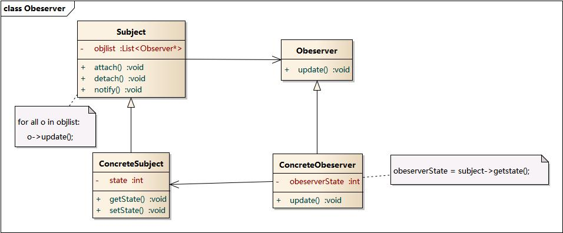

### Observer Pattern - 观察者模式  

对象行为型模式  

1. 意图  
定义对象的一种一对多的依赖关系,   
当一个对象的状态发生改变时,  
所有依赖于它的对象都得到通知并被自动更新.  

2. 别名  
发布-订阅 Publish/Subscribe  
源-监听   Source/Listener  
依赖(从属) Dependents  

3. 动机  
建立一种对象之间的依赖关系,  
一个对象发生改变时自动通知其它对象, 其它对象作出相应反应.  
在此, 发生改变的对象成为观察目标, 而被通知的对象称为观察者.  
一个观察目标可以对应多个观察者, 而观察者之间没有互相联系, 
可以根据需要增加或者删除观察者, 使得系统易于扩展.  

4. 结构  

5. 角色  
Subject:  目标  
ConcreteSubject: 具体目标  
Observer: 观察者  
ConcreteObserver: 具体观察者  

6. 理解  
(1) Subject 维护了 Observer 的 list, 并提供对此 list 的增删操作;  
(2) 当 Subject 的属性等发生变化时, 
循环调用 Observer 的 update()方法, 更新 Observer 的属性.  

7. 推模型和拉模型  
* 推模型  
主题对象向观察者推送主题的详细信息，不管观察者是否需要，  
推送的信息通常是主题对象的全部或部分数据。

* 拉模型  
主题对象在通知观察者的时候，只传递少量信息。  
如果观察者需要更具体的信息，由观察者主动到主题对象中获取，  
相当于是观察者从主题对象中拉数据。一般这种模型的实现中，会把主题对象自身通过update()方法传递给观察者，这样在观察者需要获取数据的时候，就可以通过这个引用来获取了。