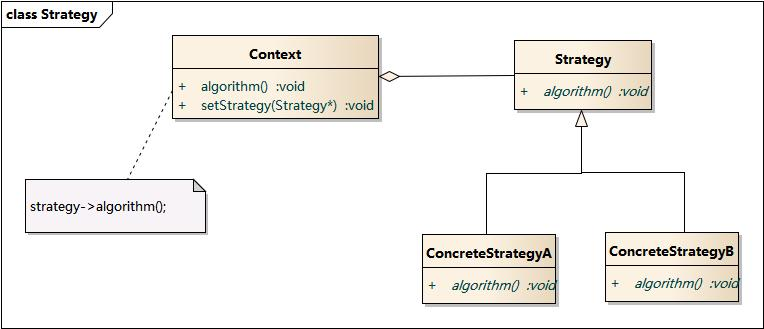

### Strategy Pattern - 策略模式  

学习难度：★☆☆☆☆  
使用频率：★★★★☆  

对象行为型模式  

1. 意图
定义一系列算法, 把它们一个个封装起来, 并且可以使它们可以相互替换. 使算法独立于使用它的客户端而变化.  

2. 别名
政策 - Policy  

3. 角色 - 结构

* Strategy : 抽象策略类  
定义所有支持的算法的公共接口  
* ConcreteStrategy : 具体策略类  
具体算法
* Context: 环境类  
用ConcreteStrategy 对象来配置;  
维护一个对 Strategy 对象的引用;  
可定义一个接口来让 Strategy 访问它的数据.  

