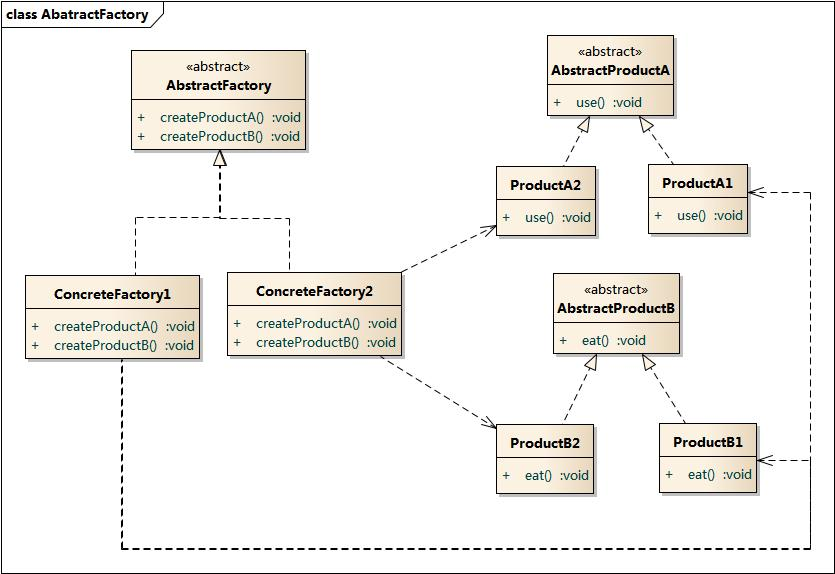

### 抽象工厂模式 - Abstract Factory Pattern  
学习难度：★★★★☆  
使用频率：★★★★★

写在前面:  
`对象创建型模型`  
产品等级结构 - 产品的继承结构(简单理解, 都是一个东西)  
`抽象类是电视机, 其子类有海尔电视机, 海信电视机等.`  
产品族 - 由同一工厂生产的, 位于不同产品等级结构中的一组产品  
`如海尔工厂生产的海尔电视, 海尔冰箱, 称为产品族.`

1. 定义(GoF)    
提供一个创建一系列相关或相互依赖对象的接口, 而无需指定它们具体的类.  
2. 别名  
Kit 
3. 动机  
4. 适用性  
(1)一个系统要独立于他的产品的创建, 组合和表示时;  
(2)一个系统要由多个产品系类中的一个来配置时;  
(3)当你要强调一系列相关的产品对象的设计以便进行联合使用时;  
(4)当你提供一个产品类库, 而只想显示它们的接口而不是实现时;
5. 角色结构  
	AbstractFactory(抽象工程)  
	声明了一组用于创建一族产品的方法, 每一个方法对应一种产品;

	ConcreteFactory(具体工厂)
	实现了在抽象工厂中声明的创建产品的方法, 生成一组具体产品,  
	这些产品构成了一个产品族,每一个产品都位于某个产品等级结构中;  

	AbstractProduct(抽象产品)  
	为每种产品声明接口, 在抽象产品中声明了产品所具有的业务方法;  

	ConcreteProduct(具体产品)  
	定义具体工厂生产的具体产品对象, 实现抽象产品接口中声明的业务方法;

6. 缺点  
新增产品等级结构时, 不能很好的支持开闭原则.

抽象工厂模式以一种倾斜的方式支持增加新的产品, 
为新产品族的增加提供方便, 
但不能为新的产品等级结构的增加提供这样的方便.  

