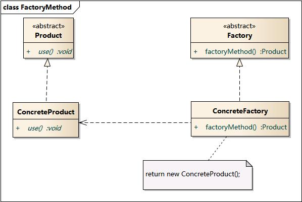

## 工厂方法模式 - factory method pattern
学习难度：★★☆☆☆  
使用频率：★★★★★

#### 写在前面: 
属于 - `类创建型模式`: 将对象的部分创建工作延迟到子类.  
对比 - 对象创建型模式: 将对象的部分创建工作延迟到另一个对象.

1. 定义: (GoF)  
定义一个用于创建对象的接口, 让子类决定实例化哪一个类.
Factory Method 使一个对象的实例化延迟到其子类.  
个人理解: 使一个对象的实例化`(从工厂类)`延迟到`(工厂类的)`子类.  

2. 别名:  
虚构造器 (Virtual Constructor)  
多态工厂 (Polymorphic Factory)  

3. 动机;  

4. 适用性:  
(1) 当一个类不知道它所必须创建的对象的类的时候;
(2) 当一个类希望由它的子类来指定它所创建的对象的时候;
(3) 当类将创建对象的职责委托给多个子类中的某一个, 并且你希望将哪一个帮助子类是代理者这一信息局部化的时候.

