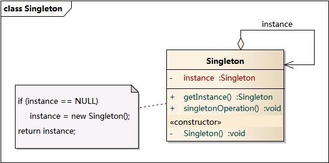

### Singleton Pattern - 单例模式  
学习难度：★☆☆☆☆  
使用频率：★★★★☆  

写在前面:  

1. 定义  
保证一个类只有一个实例, 并提供一个访问它的全局访问点.  

	理解:  
(1) 确保一个类只有一个实例;  
(2) 类自行创建这个实例;  
(3) 类提供全局的访问方法.  

2. 动机  
让类自身负责保存它唯一的实例, 并提供一个访问该实例的方法.  

3. 适用性  
(1) 当类只能有一个实例, 且客户可以从一个众所周知的访问点访问它时;  
(2) 放这个唯一实例应该是通过子类化可扩展的, 并且客户应该无需更改代码就能使用一个扩展的实例时.  

4. 结构  
  

5. 分析  
在实现过程中, 需注意三点:    
(1) 单例的构造函数为私有;  
(2) 提供一个自身的静态私有成员变量;  
(3) 提供一个公有的静态工厂方法;  

6. 模式应用  
``
一个具有自动编号主键的表可以有多个用户同时使用，
但数据库中只能有一个地方分配下一个主键编号，否则会出现主键重复，
因此该主键编号生成器必须具备唯一性，可以通过单例模式来实现。
``
 
7. 可以扩展为多例模式  

8. Java 中的 Singleton参考文章:  
https://ddatsh.com/post/dev/java/java-singleton/  

扩展阅读:  
https://ddatsh.com/post/dev/java/singleton-answer/  

讨论:  
饿汉模式 与 懒汉模式  
(1) 饿汉单例模式:  

(2) 懒汉单例模式:  

