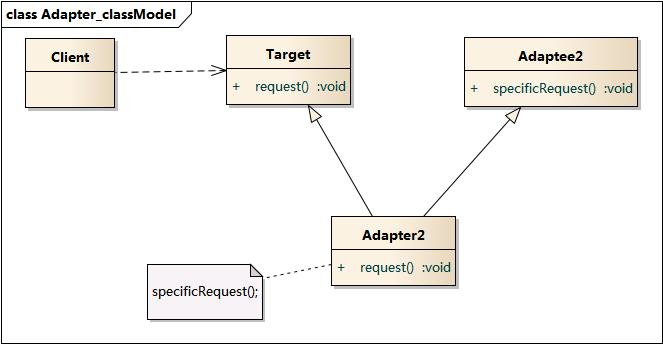
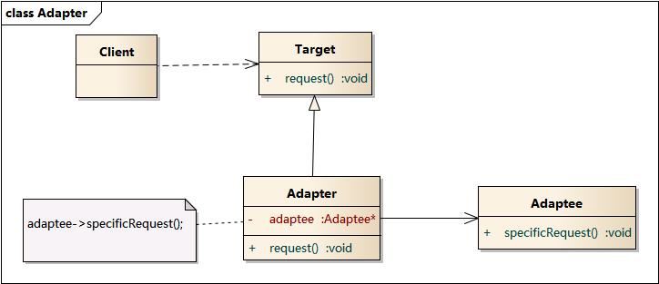

### 适配器模式 - Adapter Pattern  
学习难度：★★☆☆☆  
使用频率：★★★★☆  

类结构型模式 && 对象结构型模式

1. 意图  
讲一个类的接口转换成客户希望的另一个接口;  
使得原本由于接口不兼容而不能一起工作的类可以一起工作. 

2. 别名  
Wrapper

3. 动机  

4. 适用性  
(1) 想使用一个已经存在的类, 而它的接口不符合需求;  
(2) 想创建一个可复用的类, 该类可以与其他不相关的类或者不可预见的类协同工作;  
(3) (仅适用于对象 Adapter) 想使用一些已经存在的子类, 但是不可能对每一个都进行子类化以匹配它们的接口. 
对象适配器可以适配它们的父类接口. 

5. 结构  
(1) 类适配器使用多重继承对一个接口与另一个接口适配.  
	Adapter 同时继承 Target 和 Adaptee  
	 
(2) 对象适配器通过对象组合来实现适配.  
	Adapter 继承 Target, 依赖 Adaptee  
	
6. 参与者  
(1) Target - 目标抽象类: 客户所需接口  
(2) Adapter - 适配器类  
(3) Adaptee - 适配者类(已经存在的, 将被适配的)  
(4) Client - 客户类