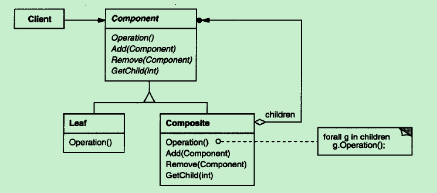

### Composite Pattern - 组合模式  

学习难度：★★★☆☆  
使用频率：★★★★☆  

1. 定义  
将对象组合成树形结构以表示"部分-整体"的层次结构.  
Composite 使得用户对单个对象和组合对象的使用具有一致性.  

组合模式通过一种巧妙的设计方案使得用户可以一致性的处理整个树形结构,  
或者树形结构的一部分,   
也可以一致性的处理树形结构中的叶子节点(不包含子节点的节点)  
和容器节点(包含子节点的节点)  

2. 动机  
Composite 模式的关键是一个抽象类, 
它既可以代表部分, 也可以代表由部分组成的容器.  

3. 结构  

4. 角色  
(1) Component  
* 为组合中的对象声明接口;  
* 在适当的情况下, 实现所有类共有接口的缺省行为;  
* 声明一个接口用于访问和管理 Component 的子组件;  
* (可选)在递归结构中定义一个接口, 用于访问一个父部件;  
(2) Leaf  
* 在组合中表示叶节点对象, 叶节点没有子节点;  
* 在组合中定义图元对象的行为;  
(3) Composite  
* 定义有子部件的那些部件的行为;  
* 存储子部件;  
* 在 Component 接口中实现与子部件有关的操作;  

5. 适用性  
(1) 想表达对象的部分-整体层次结构;  
(2) 希望用户忽略组合对象与单个对象的不同, 用户将统一地使用组合结构中的所有对象;  

6. 透明组合与安全组合  
