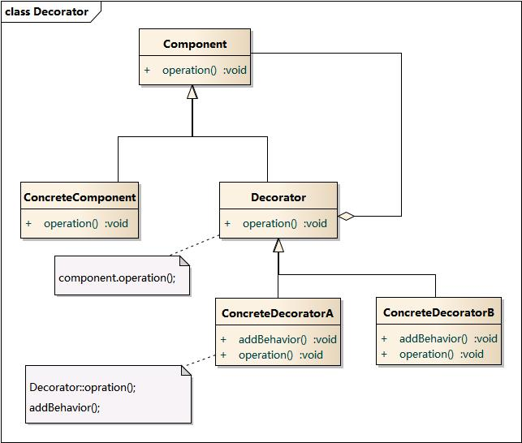

# Decorator Pattern - 装饰模式 
学习难度：★★★☆☆  
使用频率：★★★☆☆  

对象结构型模式  

1. 意图  
动态地给一个对象增加一些额外的职责.  
就增加功能来说, Decorator 模式比生成子类更加灵活.  

2. 别名  
Wrapper (跟 Adapter 的别名一样...)

3. 动机  
一般有两种方式可以实现给一个类或者对象增加行为:
* 继承机制: 通过集成一个现有的类可以使得子类在拥有父类方法的基础上添加额外的方法. 
但是这种方法是静态的, 用户不能控制增加行为的方法和时机.  
* 关联机制: 将一个对象嵌入另一个对象中, 
由另一对象来决定是否调用嵌入对象的行为以便扩展自己的行为. 
我们称这个嵌入的对象为装饰器( Decorator).  
	装饰模式以对客户透明的方式动态的给一个对象附加上更多的责任,  
换言之, 客户端并不会觉得对象在装饰前后有什么不同.  
装饰模式可以在不需要创造更多子类的情况下, 将对象的功能扩展.  

4. 结构

5. 角色  
* Component: 抽象构件  
	Component 与 Decorator 的公共接口.  
* ConcreteComponent:  具体构件  
	  
* Decorator:  抽象装饰类  
	维持一个指向 Component 对象的指针, 
	并定义一个与 Component接口一致的接口.  
* ConcreteDecorator:  具体装饰类  
	向组件添加职责  
	 