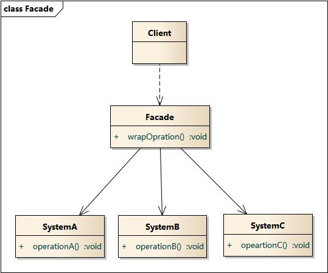
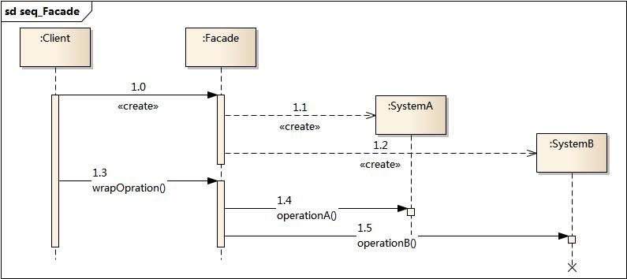

### 外观模式 - Facade Pattern  

学习难度：★☆☆☆☆  
使用频率：★★★★★  

对象结构型模式  
是迪米特法则的一种具体实现  

1. 意图  
外部与子系统的通信必须通过一个统一的外观对象进行, 外观对象为子系统中的一组接口提供一个一致的界面,  
Facade 模式定义了一个高层接口, 这个接口使得这一子系统更加容易使用.  

2. 动机  
讲一个系统花粉症若干个子系统有利于降低系统的复杂性, 一个常见的目标是是子系统间的通信和相互依赖关系达到最小.  
达到该目标的途径之一就是引入一个外观( facade)对象, 它为子系统中较一般的设施提供了一个单一而简单的界面.  

3. 结构  

4. 角色  
* Facade - 外观角色  
知道哪些子系统负责处理请求;  
将客户的请求代理给适当的子系统对象;  
* Subsystem classes - 子系统角色   
实现子系统的功能;  
处理由 Facade 对象指派的任务;  
没有 facade 的任何信息, 即没有指向 facade 的指针;  

5. 扩展 - 抽象外观类  
在标准的外观模式结构中, 如果需要增改删与外观类交互的子系统类, 必须修改外观类或者客户端的代码,  
这将违背开闭原则, 因此可以通过引入抽象外观类来对系统进行改进. 

6. 优缺点  
	[1] 模式优点  
	(1) 它对客户端屏蔽了子系统组件，减少了客户端所需处理的对象数目，并使得子系统使用起
来更加容易。通过引入外观模式，客户端代码将变得很简单，与之关联的对象也很少。  
	(2) 它实现了子系统与客户端之间的松耦合关系，这使得子系统的变化不会影响到调用它的客
户端，只需要调整外观类即可。  
	(3) 一个子系统的修改对其他子系统没有任何影响，而且子系统内部变化也不会影响到外观对
象。  

	[2] 模式缺点    
	(1) 不能很好地限制客户端直接使用子系统类，如果对客户端访问子系统类做太多的限制则减
少了可变性和灵活性。  
	(2) 如果设计不当，增加新的子系统可能需要修改外观类的源代码，违背了开闭原则。  

7. 模式适用场景  
(1) 当要为访问一系列复杂的子系统提供一个简单入口时可以使用外观模式。  
(2) 客户端程序与多个子系统之间存在很大的依赖性。引入外观类可以将子系统与客户端解耦，
从而提高子系统的独立性和可移植性。  
(3) 在层次化结构中，可以使用外观模式定义系统中每一层的入口，层与层之间不直接产生联系，
而通过外观类建立联系，降低层之间的耦合度。  