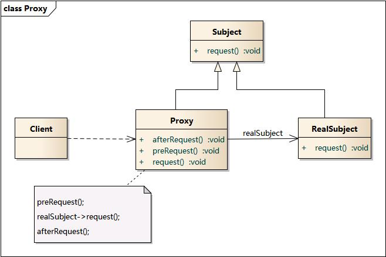

### 代理模式 - Proxy Pattern

学习难度：★★★☆☆  
使用频率：★★★★☆

1. 意图  
为其它对象提供一种代理以控制对这个对象的访问.  

2. 别名  
Surrogate  

3. 动机  
对一个对象进行访问控制的一个原因是为了只有在我们确实需要这个对象时,  
才对它进行创建和初始化.  

	在某些情况下, 一个客户不想或者不能直接引用一个对象,  
此时可以通过一个称之为"代理"的第三者来实现间接引用.  
代理对象可以在客户端和目标对象之间起到中介的作用,  
并且可以通过代理对象去掉客户不能或者不想看到的内容和服务,  
或者添加客户需要的额外服务. 

4. 结构  

5. 角色  
Subject: 抽象主题角色  
`定义RealSubject 和 Proxy 的共用接口,  
这样就可以在任何使用RealSubject 的地方都可以使用 Proxy.`  
Proxy: 代理主题角色  
`--> 保存一个引用使得代理可以访问 RealSubject.  
若 RealSubject 与 Subject 接口相同, Proxy 会引用 Subject.`  
`--> 提供一个与 Subject 的接口相同的接口, 这样代理就可以用来代替实体`   
`--> 控制对实体的存取, 并可能负责创建和删除它`

RealSubject: 真实主题角色  
-- 被 Proxy 代理(代表)的角色

6. 适用性  
(1) 远程代理(Remote Proxy) 为一个对象在不同的地址空间提供局部代表;  
(2) 虚代理(Virtual Proxy) 根据需要创建开销很大的对象, 将对象的创建推迟到使用时;  
(3) 保护代理( Protection Proxy) 控制对原始对象的访问;  
(4) 智能指引( Smart Reference) 取代简单的指针. 在访问对象时增加一些附加操作.  
`典型用途:`  
`对指向实际对象的引用计数`
`当第一次引用一个持久对象时, 将它装入内存`  
`在访问一个实际对象前, 检查是否已经锁定了它, 以确保其它对象不能改变它`  
(5) 缓冲代理( Cache) 为某一个目标操作的结果临时提供的存储空间, 以便多个客户端可以共享这些结果;    
(6) 防火墙代理(Firewall) 保护目标不让恶意用户接近;  
(7) 同步化代理( Synchronization) 使几个用户能够同时使用一个对象而没有冲突.  

7. 扩展  
动态代理:  
较高级的代理模式, 典型应用 Spring AOP  
在传统代理模式中, 真实主题必须是已经事先存在的, 并将其作为代理对象的内部成员属性.  
如果一个代理必须对应一个真实主题, 那么系统中的类个数会剧增.  
因此要想减少系统中类的个数,   
此外, 要在实现不知道真实主题的情况下使用代理,  
这些都是动态代理需要解决的问题.  
